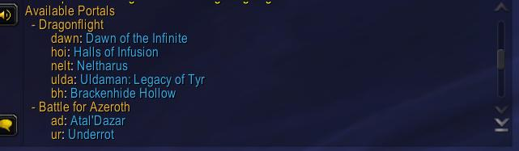
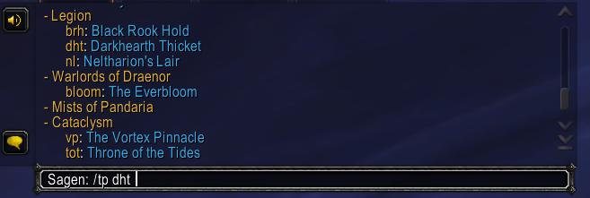
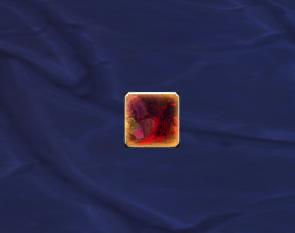
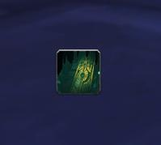

# KSH Portals
Searching the spellbook for specific teleports from the *Keystone Hero* achievement can be 
quite annoying, and keybinding them consumes more space on your action bar.  

This tool allows you to invoke the teleports from the chat, via a tiny command:  

`/tp fh` -> which teleports you to Freehold.  


### Screenshots
Using "/tp" or "/tp help"  
  

Using a command  
  


## Supported Portals
Currently, this addon supports KSH teleports from Dragonflight S3+.  
Older teleports are not supported right now, because some some teleports spells 
using two different spell id's. And respecting two different id's for the same 
dungeon, requires some bigger refactoring of the code. This might be change in 
the future.

If you really need a specific teleport, I refer to the [Developer Section](#Developer Section).  


## Limitations
Due Blizzards API policy, spells can not be invoked directly from a LUA command.  
For that reason, a button will appear under your mouse cursor, where you have to confirm the spell.  

Any mouse click outside this button, will cancel the spell command.  

### Screenshots
Example confirmation buttons (DHT, Dawn, Underrot)  
    


## Usage
**List all your available KSH portals**  
`/tp help` or `/tp`  

*Example Output*
```
Available Portals
    bh: Brackenhide Hollow
    nelt: Neltharus
    hoi: Halls of Infusion
    ulda: Uldaman: Legacy of Tyr
    dawn: Dawn of the Infinite
    fh: Freehold
    ur: Underrot
```

**Teleport to a dungeon:**  
`/tp <Dungeon Abbreviation>`  

# Developer Section
## Adding a new portal
If you want to add a new teleport or portal, you can modify the `portals.lua`file.  
There are two tables: `NS.portals` and `NS.portal_labels`. If you're modify one table, you have to also adapt the second one.  

### `NS.portals`
**Key:** abbreviation of the spell  
**Value:** SpellID  

### `NS.portal_labels`
**Key:** abbreviation of the spell  
**Value:** Name of the dungeon  

## Changing the slash command
If the slash command `/tp` is conflicting with a addon, you can change it in `KSHPortals.lua`: `SLASH_KSHPORTALS1 = `  


